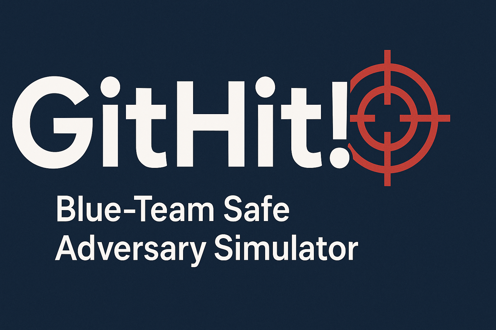

# GitHit! 🎯 — Blue-Team Safe Adversary Simulator

<p align="center">
  
</p>

<p align="center"><em>Think like an attacker, train like a defender — safely.</em></p>

[](https://github.com/your-username/githit-adversary-sim/actions)  
[](LICENSE)

**GitHit!** is a project I built to help **security teams** (and myself!) test detections without running any risky exploits.
It safely **mimics attacker behaviors** in a **lab environment only**, giving blue teams the chance to validate alerts, SIEM rules, and incident response playbooks.

I wanted a tool that:
- Stays **safe by design** (localhost/RFC1918 only, explicit consent flag, hard guardrails).
- Produces **realistic signals** for monitoring tools without actually breaking in anywhere.
- Is easy to extend with new “plays” (plugins) so I can add scenarios over time.

---

## ✨ Features
- Guardrails first: requires `I_UNDERSTAND_AND_HAVE_PERMISSION=YES` and lab-only targets.
- Modular “plays”:
  - **Recon** (TCP connect scans against localhost).
  - **Auth Spray** (synthetic failed-auth log generator).
  - **Exfil** (send dummy bytes to a local sink).
- Telemetry: JSON run results saved under `runs/`.
- Docker/Compose support for quick spin-up.
- GitHub Actions CI to lint & test across Python 3.9–3.12.

---

## 🚀 Quickstart

### Local install
```bash
pip install -e .
export I_UNDERSTAND_AND_HAVE_PERMISSION=YES

# Optional: start the local sink server
python examples/start_sink.py

# Run with the sample config
adversary-sim --config examples/config.lab.json
```

### Docker / Compose
```bash
docker compose up --build
# results will be written to ./runs on your host
```

---

## 📊 CI / Dev Tooling
- GitHub Actions CI runs **Ruff** + **Pytest** automatically.
- Dev requirements:
  ```bash
  pip install -r requirements-dev.txt
  ```
- Pre-commit hook (optional):
  ```bash
  pip install pre-commit
  pre-commit install
  ```

---

## 🧪 Example Config
```json
{
  "run_id": "sim-001",
  "scope_allowlist": ["127.0.0.1/32"],
  "plays": [
    {"id": "recon_local", "module": "adversary_sim.plays.recon", "target_host": "127.0.0.1", "ports": [22,80,443]},
    {"id": "auth_spray_lab", "module": "adversary_sim.plays.auth_spray", "log_path": "lab_logs/auth.log", "attempts": 10, "usernames": ["labuser","guest"]},
    {"id": "exfil_local_sink", "module": "adversary_sim.plays.exfil", "target_url": "http://127.0.0.1:8080/upload", "bytes": 262144}
  ]
}
```

---

## 🔒 Safety Notes
This project is for **defensive training only**.
It will **refuse to run** against anything outside your lab / private ranges.
Every play is designed to generate safe, reversible signals (no exploitation).

---

## 📜 License
MIT — free to use, share, and improve.
